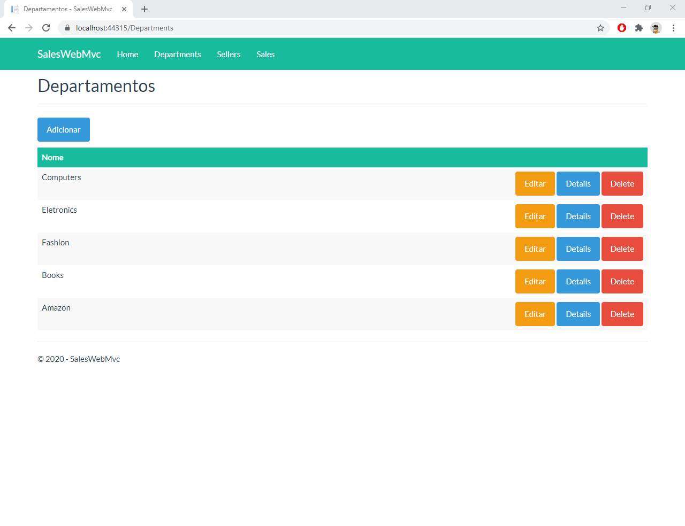
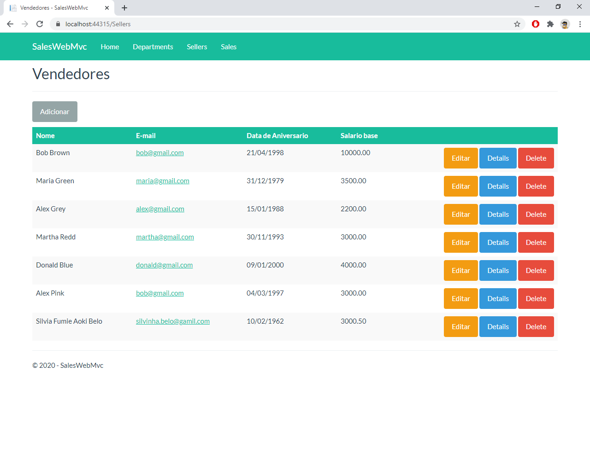
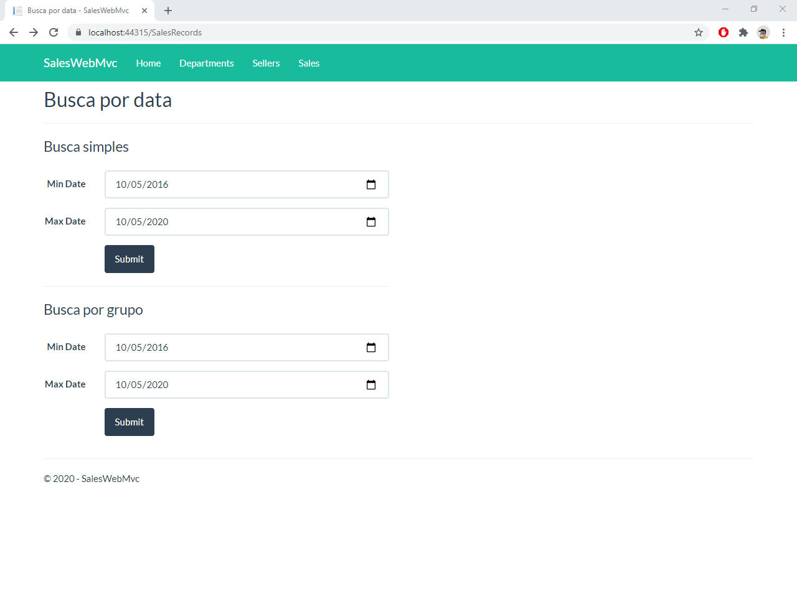

# Por que?

Criado para entender a estrutura MVC web, e  estudar o asp.net Core usando como banco de dados MySQl com a ulização do Entity Framework.
programa desenvolvido na IDE Visual Studio 2019.

# Funções
 Tela de listagem de Departamentos criados, ao clicar nos botões redireciona para telas descritas por eles.

 Tela de Vendedores criados.

 Tela de Busca traz a busa simples que retorna o da dos de todos vendedores, e a busca agrupada que retorna todos os dados dos vendedores separados por setores.

